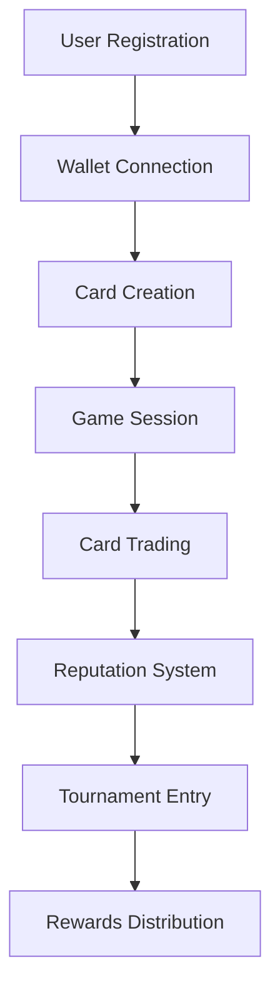

# 🚀 Secret Draft Cards - Complete Submission Workflow

> **End-to-End Process Documentation for Secret Draft Cards Platform**

## 📋 Overview

This document outlines the complete submission workflow for the Secret Draft Cards platform, covering everything from initial setup to production deployment and user onboarding.

---

## 🎯 Workflow Architecture



---

## 🔧 Development Workflow

### 1. Local Development Setup

```bash
# Clone repository
git clone https://github.com/LunaTechLab56/secret-draft-cards.git
cd secret-draft-cards

# Install dependencies
npm install

# Set up environment variables
cp env.example .env.local
# Edit .env.local with your configuration

# Start development server
npm run dev
```

### 2. Code Quality Checks

```bash
# Run linting
npm run lint

# Run type checking
npm run type-check

# Run tests
npm run test

# Build for production
npm run build
```

### 3. Git Workflow

```bash
# Create feature branch
git checkout -b feature/your-feature-name

# Make changes and commit
git add .
git commit -m "feat: add your feature description"

# Push to remote
git push origin feature/your-feature-name

# Create pull request
# Merge after review
```

---

## 🌐 Deployment Pipeline

### 1. Staging Environment

```bash
# Deploy to staging
npm run build:staging
npm run deploy:staging
```

### 2. Production Deployment

```bash
# Deploy to production
npm run build:production
npm run deploy:production
```

### 3. Vercel Deployment

1. **Automatic Deployment**
   - Push to `main` branch triggers automatic deployment
   - Environment variables configured in Vercel dashboard
   - Custom domain setup available

2. **Manual Deployment**
   ```bash
   # Install Vercel CLI
   npm i -g vercel
   
   # Deploy
   vercel --prod
   ```

---

## 🎮 User Onboarding Flow

### 1. Initial Access

```typescript
// User lands on homepage
const HomePage = () => {
  return (
    <div className="min-h-screen bg-gradient-to-br from-purple-900 to-blue-900">
      <HeroSection />
      <WalletConnect />
      <FeatureShowcase />
    </div>
  );
};
```

### 2. Wallet Connection Process

```typescript
// Wallet connection flow
const WalletConnectionFlow = () => {
  const { connect, disconnect, isConnected, address } = useAccount();
  
  const handleConnect = async () => {
    try {
      await connect();
      // Redirect to dashboard
      router.push('/dashboard');
    } catch (error) {
      console.error('Connection failed:', error);
    }
  };
  
  return (
    <ConnectButton 
      onConnect={handleConnect}
      onDisconnect={disconnect}
    />
  );
};
```

### 3. Card Creation Workflow

```typescript
// Card creation process
const CardCreationFlow = () => {
  const [cardData, setCardData] = useState({
    name: '',
    imageHash: '',
    encryptedStats: null
  });
  
  const handleCreateCard = async () => {
    try {
      // Encrypt card statistics using FHE
      const encryptedStats = await encryptCardStats(cardData);
      
      // Mint card on blockchain
      const tx = await mintCard({
        name: cardData.name,
        imageHash: cardData.imageHash,
        ...encryptedStats
      });
      
      await tx.wait();
      toast.success('Card created successfully!');
    } catch (error) {
      toast.error('Failed to create card');
    }
  };
  
  return (
    <CardCreationForm 
      onSubmit={handleCreateCard}
      data={cardData}
      onChange={setCardData}
    />
  );
};
```

---

## 🎯 Game Session Management

### 1. Matchmaking System

```typescript
// Matchmaking process
const MatchmakingSystem = () => {
  const [searching, setSearching] = useState(false);
  const [opponent, setOpponent] = useState(null);
  
  const findOpponent = async () => {
    setSearching(true);
    try {
      const match = await findMatch({
        playerRank: userRank,
        preferredGameMode: 'ranked'
      });
      setOpponent(match.opponent);
    } catch (error) {
      toast.error('Failed to find opponent');
    } finally {
      setSearching(false);
    }
  };
  
  return (
    <MatchmakingInterface 
      onFindOpponent={findOpponent}
      searching={searching}
      opponent={opponent}
    />
  );
};
```

### 2. Game State Management

```typescript
// Game session state
interface GameSession {
  sessionId: string;
  player1: string;
  player2: string;
  turnCount: number;
  gameState: 'waiting' | 'active' | 'completed';
  winner?: string;
  encryptedData: {
    player1Cards: EncryptedCard[];
    player2Cards: EncryptedCard[];
    gameHistory: EncryptedMove[];
  };
}

const GameSessionManager = () => {
  const [session, setSession] = useState<GameSession | null>(null);
  
  const playCard = async (cardId: string, targetId?: string) => {
    try {
      const move = await createEncryptedMove({
        cardId,
        targetId,
        sessionId: session.sessionId
      });
      
      await submitMove(move);
      toast.success('Move submitted successfully!');
    } catch (error) {
      toast.error('Failed to submit move');
    }
  };
  
  return (
    <GameInterface 
      session={session}
      onPlayCard={playCard}
    />
  );
};
```

---

## 💰 Trading System

### 1. Card Trading Flow

```typescript
// Trading system
const TradingSystem = () => {
  const [offers, setOffers] = useState<TradeOffer[]>([]);
  const [selectedCard, setSelectedCard] = useState(null);
  
  const createTradeOffer = async (cardId: string, price: number) => {
    try {
      const offer = await createTradeOffer({
        cardId,
        price: encryptValue(price),
        seller: address
      });
      
      setOffers(prev => [...prev, offer]);
      toast.success('Trade offer created!');
    } catch (error) {
      toast.error('Failed to create trade offer');
    }
  };
  
  const acceptTradeOffer = async (offerId: string) => {
    try {
      await acceptTrade(offerId);
      toast.success('Trade completed successfully!');
    } catch (error) {
      toast.error('Failed to complete trade');
    }
  };
  
  return (
    <TradingInterface 
      offers={offers}
      onCreateOffer={createTradeOffer}
      onAcceptOffer={acceptTradeOffer}
      selectedCard={selectedCard}
      onSelectCard={setSelectedCard}
    />
  );
};
```

---

## 🏆 Reputation & Rewards System

### 1. Reputation Management

```typescript
// Reputation system
const ReputationSystem = () => {
  const [reputation, setReputation] = useState(0);
  const [achievements, setAchievements] = useState([]);
  
  const updateReputation = async (action: string, value: number) => {
    try {
      const newReputation = await updatePlayerReputation({
        player: address,
        action,
        value: encryptValue(value)
      });
      
      setReputation(newReputation);
      checkAchievements(newReputation);
    } catch (error) {
      console.error('Failed to update reputation:', error);
    }
  };
  
  return (
    <ReputationDashboard 
      reputation={reputation}
      achievements={achievements}
      onUpdate={updateReputation}
    />
  );
};
```

### 2. Tournament System

```typescript
// Tournament management
const TournamentSystem = () => {
  const [tournaments, setTournaments] = useState([]);
  const [activeTournament, setActiveTournament] = useState(null);
  
  const joinTournament = async (tournamentId: string) => {
    try {
      await joinTournament({
        tournamentId,
        player: address,
        entryFee: encryptValue(entryFee)
      });
      
      toast.success('Successfully joined tournament!');
    } catch (error) {
      toast.error('Failed to join tournament');
    }
  };
  
  return (
    <TournamentInterface 
      tournaments={tournaments}
      activeTournament={activeTournament}
      onJoinTournament={joinTournament}
    />
  );
};
```

---

## 🔒 Security & Privacy

### 1. FHE Encryption Layer

```typescript
// FHE encryption utilities
class FHEEncryption {
  static async encryptCardStats(stats: CardStats): Promise<EncryptedCardStats> {
    return {
      attack: await encrypt(stats.attack),
      defense: await encrypt(stats.defense),
      health: await encrypt(stats.health),
      mana: await encrypt(stats.mana),
      rarity: await encrypt(stats.rarity)
    };
  }
  
  static async decryptCardStats(encryptedStats: EncryptedCardStats): Promise<CardStats> {
    return {
      attack: await decrypt(encryptedStats.attack),
      defense: await decrypt(encryptedStats.defense),
      health: await decrypt(encryptedStats.health),
      mana: await decrypt(encryptedStats.mana),
      rarity: await decrypt(encryptedStats.rarity)
    };
  }
}
```

### 2. Access Control

```typescript
// Access control middleware
const withAuth = (Component: React.ComponentType) => {
  return (props: any) => {
    const { isConnected, address } = useAccount();
    
    if (!isConnected) {
      return <WalletConnectionPrompt />;
    }
    
    return <Component {...props} />;
  };
};
```

---

## 📊 Analytics & Monitoring

### 1. User Analytics

```typescript
// Analytics tracking
const useAnalytics = () => {
  const trackEvent = (event: string, properties?: any) => {
    // Track user events
    analytics.track(event, {
      userId: address,
      timestamp: Date.now(),
      ...properties
    });
  };
  
  const trackGameSession = (sessionData: GameSession) => {
    trackEvent('game_session_completed', {
      sessionId: sessionData.sessionId,
      duration: sessionData.duration,
      winner: sessionData.winner
    });
  };
  
  return { trackEvent, trackGameSession };
};
```

### 2. Performance Monitoring

```typescript
// Performance monitoring
const PerformanceMonitor = () => {
  useEffect(() => {
    // Monitor page load times
    const observer = new PerformanceObserver((list) => {
      list.getEntries().forEach((entry) => {
        if (entry.entryType === 'navigation') {
          analytics.track('page_load_time', {
            loadTime: entry.loadEventEnd - entry.loadEventStart
          });
        }
      });
    });
    
    observer.observe({ entryTypes: ['navigation'] });
    
    return () => observer.disconnect();
  }, []);
  
  return null;
};
```

---

## 🧪 Testing Framework

### 1. Unit Tests

```typescript
// Example unit test
describe('CardCreation', () => {
  it('should create a card with encrypted stats', async () => {
    const cardData = {
      name: 'Test Card',
      attack: 100,
      defense: 80,
      health: 120
    };
    
    const encryptedCard = await FHEEncryption.encryptCardStats(cardData);
    
    expect(encryptedCard.name).toBe(cardData.name);
    expect(encryptedCard.attack).toBeDefined();
    expect(encryptedCard.defense).toBeDefined();
  });
});
```

### 2. Integration Tests

```typescript
// Example integration test
describe('Game Session Flow', () => {
  it('should complete a full game session', async () => {
    // Setup players
    const player1 = await createTestPlayer();
    const player2 = await createTestPlayer();
    
    // Create game session
    const session = await createGameSession(player1, player2);
    
    // Play game
    await playCard(session.id, player1.cards[0]);
    await playCard(session.id, player2.cards[0]);
    
    // End game
    const result = await endGameSession(session.id);
    
    expect(result.winner).toBeDefined();
    expect(result.status).toBe('completed');
  });
});
```

### 3. End-to-End Tests

```typescript
// Example E2E test
describe('Complete User Journey', () => {
  it('should complete full user onboarding and gameplay', async () => {
    // Connect wallet
    await page.click('[data-testid="connect-wallet"]');
    await page.waitForSelector('[data-testid="wallet-connected"]');
    
    // Create first card
    await page.click('[data-testid="create-card"]');
    await page.fill('[data-testid="card-name"]', 'My First Card');
    await page.click('[data-testid="submit-card"]');
    
    // Find opponent
    await page.click('[data-testid="find-opponent"]');
    await page.waitForSelector('[data-testid="game-started"]');
    
    // Play game
    await page.click('[data-testid="play-card"]');
    await page.waitForSelector('[data-testid="game-ended"]');
    
    // Verify results
    const winner = await page.textContent('[data-testid="game-winner"]');
    expect(winner).toBeDefined();
  });
});
```

---

## 🚀 Production Checklist

### Pre-Deployment

- [ ] All tests passing
- [ ] Code review completed
- [ ] Security audit passed
- [ ] Performance benchmarks met
- [ ] Environment variables configured
- [ ] Database migrations applied
- [ ] CDN configuration verified

### Post-Deployment

- [ ] Health checks passing
- [ ] Monitoring alerts configured
- [ ] Backup systems verified
- [ ] User acceptance testing completed
- [ ] Documentation updated
- [ ] Support team trained

---

## 📞 Support & Maintenance

### 1. Error Handling

```typescript
// Global error handler
const ErrorBoundary = ({ children }: { children: React.ReactNode }) => {
  const [error, setError] = useState(null);
  
  useEffect(() => {
    const handleError = (error: Error) => {
      setError(error);
      // Log error to monitoring service
      errorReporting.captureException(error);
    };
    
    window.addEventListener('error', handleError);
    return () => window.removeEventListener('error', handleError);
  }, []);
  
  if (error) {
    return <ErrorFallback error={error} />;
  }
  
  return children;
};
```

### 2. User Support

```typescript
// Support system
const SupportSystem = () => {
  const [tickets, setTickets] = useState([]);
  
  const createSupportTicket = async (issue: string) => {
    try {
      const ticket = await createTicket({
        userId: address,
        issue,
        timestamp: Date.now()
      });
      
      setTickets(prev => [...prev, ticket]);
      toast.success('Support ticket created!');
    } catch (error) {
      toast.error('Failed to create support ticket');
    }
  };
  
  return (
    <SupportInterface 
      tickets={tickets}
      onCreateTicket={createSupportTicket}
    />
  );
};
```

---

## 📈 Success Metrics

### Key Performance Indicators

- **User Engagement**: Daily active users, session duration
- **Game Performance**: Match completion rate, average game time
- **Trading Activity**: Number of trades, average trade value
- **User Retention**: 7-day, 30-day retention rates
- **Technical Metrics**: Page load time, error rates, uptime

### Monitoring Dashboard

```typescript
// Analytics dashboard
const AnalyticsDashboard = () => {
  const [metrics, setMetrics] = useState({
    activeUsers: 0,
    gamesPlayed: 0,
    tradesCompleted: 0,
    averageSessionTime: 0
  });
  
  useEffect(() => {
    const fetchMetrics = async () => {
      const data = await getAnalyticsMetrics();
      setMetrics(data);
    };
    
    fetchMetrics();
    const interval = setInterval(fetchMetrics, 60000); // Update every minute
    
    return () => clearInterval(interval);
  }, []);
  
  return (
    <MetricsDashboard 
      metrics={metrics}
      onRefresh={() => window.location.reload()}
    />
  );
};
```

---

## 🎉 Conclusion

This comprehensive submission workflow ensures a smooth, secure, and scalable experience for all users of the Secret Draft Cards platform. The end-to-end process covers everything from initial development to production deployment and ongoing maintenance.

For questions or support, please refer to the documentation or contact the development team.

---

**Built with ❤️ by the Secret Draft Cards Team**
